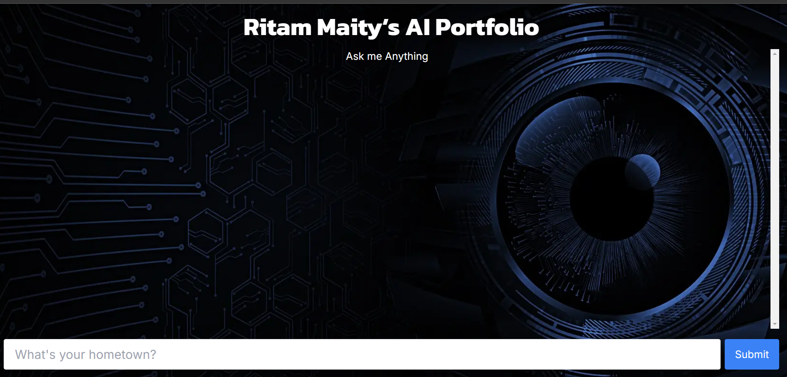

# AI Driven Portfolio with Next JS and Vector Embeddings

<figure>
  <figcaption>Screenshot (on desktop screen)</figcaption>
  
</figure>


## Installation

1. **Clone the repository:**

   ```bash
   git clone https://github.com/ritammaity55/ai-portfolio.git
2. **Change the directory to the following folder:**
    ```bash
    cd .\ai-portfolio\
3. **Install dependencies:**
    ```bash
    npm install
    npm install @datastax/astra-db-ts
    npm install langchain
    npm install dotenv
    npm install openai
    npm install ai
4. **Store the keys in the '.env' file**

    Create a '.env' file. Paste the openai key in the 'OPENAI_KEY' variable. Login to DataStax Database. From there you will get the astra db API endpoint and the application token. paste them in the respecitve variables below. Paste 'default_keyspace' in the 'ASTRA_DB_NAMESPACE' variable.
    ```bash
    OPENAI_KEY=
    ASTRA_DB_API_ENDPOINT=
    ASTRA_DB_APPLICATION_TOKEN=
    ASTRA_DB_NAMESPACE=
5. **Run the development server:**
   ```bash
    npm run dev
